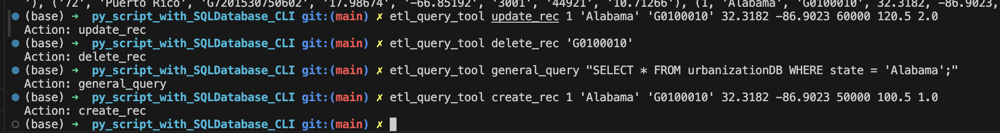

## ETL-Query Tool Package generation and interacting with SQL Database viw CLI
### By Tursunai Turumbekova
[](https://github.com/nogibjj/py_script_with_SQLDatabase_CLI/actions/workflows/cicd.yml)

## Project Overview

This is a Python command-line tool for performing ETL (Extract, Transform, Load) operations and CRUD operations on an SQLite database. The tool is packaged using setuptools and can be installed and used via the command line.

### Features:
- **Extract Data**: Extract data from a given URL and save it to a local file.
- **Transform & Load Data**: Transform and load the extracted data into an SQLite database.
- **CRUD Operations**: Create, read, update, and delete records from the database.
- **SQL Query Execution**: Run custom SQL queries on the SQLite database.


## File Structure

The project is organized into the following structure:
```bash
py_script_with_SQLDatabase/
│
├── mylib/
│   ├── extract.py           # Contains the function to extract data
│   ├── transform_load.py     # Contains the function to load and transform data into the SQLite database
│   ├── query.py              # Contains functions for CRUD operations and SQL queries
│
├── data/
│   └── urbanization.csv      # Sample dataset used for loading into the database
│
├── .github/
│   └── workflows/            # CI/CD pipeline configurations
│
├── setup.py                  # Sets up etl_query_tool application to run operation through CLI  
├── main.py                   # Main script for executing CRUD operations via CLI
├── test_main.py              # Unit tests for the CRUD operations
├── Makefile                  # Automation for testing, linting, and formatting
├── requirements.txt          # Python dependencies
└── README.md                 # Project documentation
```

## Installation

To install this tool, you can clone the repository and install it using `pip`:

1. **Clone the repository**:
    ```bash
    git clone https://github.com/nogibjj/py_script_with_SQLDatabase_CLI.git
    cd py_script_with_SQLDatabase_CLI
    ```

2. **Install the package**:
    ```bash
    pip install .
    ```
## Accessing the Package

Once the package is installed, you can access and run the command-line tool `etl_query_tool` directly from your terminal. The tool provides various options to perform ETL and CRUD operations on an SQLite database. 

To confirm that the tool is installed and accessible, you can run:

    ```bash
    etl_query_tool --help
    ```
## Sample CRUD Operations

You can run the following commands via CLI to perform CRUD operations in the database:

- **Create**:
    ```bash
    etl_query_tool create_rec 1 'Alabama' 'G0100010' 32.3182 -86.9023 50000 100.5 1.0
    ```

- **Read**:
    ```bash
    etl_query_tool read_data
    ```

- **Update**:
    ```bash
    etl_query_tool update_rec 1 'Alabama' 'G0100010' 32.3182 -86.9023 60000 120.5 2.0
    ```

- **Delete**:
    ```bash
    etl_query_tool delete_rec 'G0100010'
    ```

- **Execute General Query**:
    ```bash
    etl_query_tool general_query "SELECT * FROM urbanizationDB WHERE state = 'Alabama';"
    ```


Explanations of the functions can be found in the `main.py` script, where each CRUD operation is implemented.

### CI/CD, Linting, and Testing

- **Check format and test errors**:
    ```bash
    make format
    ```

- **Lint code**:
    ```bash
    make lint
    ```

- **Test code**:
    ```bash
    make test
    ```
## Query Log
This project includes a query log feature that tracks all SQL queries executed during the CRUD operations. The log records the following:
SQL statements for inserts, updates, deletes, and selects.
Each query is stored in a Markdown file **(query_log.md)**, providing a clear history of all database interactions.


## How to Use

### Running CRUD Operations in Comand Line:

- **Create Record**:
    ```bash
    etl_query_tool create_rec <statefips> <state> <gisjoin> <lat_tract> <long_tract> <population> <adj_radiuspop_5> <urbanindex>
    ```

- **Read Data**:
    ```bash
    etl_query_tool read_data
    ```

- **Update Record**:
    ```bash
    etl_query_tool update_rec <statefips> <state> <gisjoin> <lat_tract> <long_tract> <population> <adj_radiuspop_5> <urbanindex>
    ```

- **Delete Record**:
    ```bash
    etl_query_tool delete_rec <gisjoin>
    ```

- **Execute General Query**:
    ```bash
    python main.py general_query <SQL query>
    ```

### Testing and CI/CD Pipeline:

The project includes unit tests for each CRUD operation and a CI/CD pipeline to automate the testing process.

- To run tests:
    ```bash
    make unittest
    ```

- The CI/CD pipeline will automatically verify the correctness of the database operations by loading the `.db` file and running the tests as part of the pipeline process.

